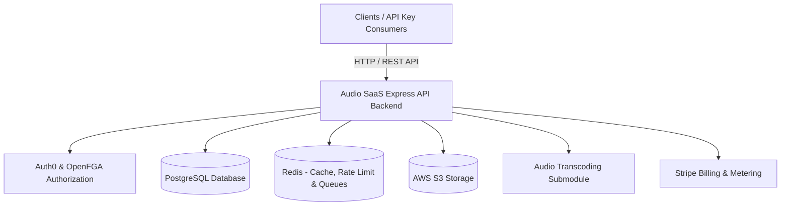

# Audio Streaming Backend Platform

An effort to build scalable audio streaming (SaaS like) backend platform built with **Node.js**, **TypeScript**, **Express**, **Prisma (PostgreSQL)**, **Auth0**, **OpenFGA**, **BullMQ**, **AWS S3**, and **Stripe**.

> 🖥️ **Frontend MVP Prototype**: Looking for the user interface client? Check out the frontend MVP prototype repository at [helloGourab/audio-saas-ui](https://github.com/helloGourab/audio-saas-ui).

---

## High-Level Architecture Overview



---

## Key Features & Capabilities

### 🔐 Authentication & Real-Time Sync

Integrated with **Auth0** for JWT authentication. Uses **Auth0 Actions** to trigger real-time user database synchronization upon registration, alongside custom API Key generation and management.

### 🛡️ Fine-Grained Authorization (FGA)

Relationship-based access control powered by **OpenFGA** (`model.fga`) to enforce fine-grained permissions for artist profile owners, manager delegations, album visibility, and playlist collaboration.

### 🎧 Audio Transcoding Pipeline

Direct-to-S3 presigned upload workflow paired with an isolated **FFmpeg audio transcoding container** that processes raw audio files into HLS web streaming formats asynchronously.

### 💳 Tiered & Metered Stripe Billing

Supports fixed subscription tiers (`FREE`, `LITE`, `PRO`) alongside **Pay-As-You-Go Metered Billing** for API-key consumers using Stripe's Metered Usage API and upfront card vaulting (`mode: 'setup'`).

### 🔄 Eventual Consistency via Outbox Pattern

Ensures database operations and asynchronous external side-effects (OpenFGA relationship updates, S3 cleanup) remain synchronized using the **Transactional Outbox Pattern** with **BullMQ**.

### ⚡ High-Throughput Batch Engagement

Buffers play counts and engagement events in Redis queues, which are periodically flushed to PostgreSQL in high-efficiency bulk batches via the `engagement-bg-svc` microservice.

---

## 🛠️ Technology Stack

| Category                      | Technology                                                 |
| :---------------------------- | :--------------------------------------------------------- |
| **Core Framework**            | Node.js (v20+), TypeScript, Express.js (v5)                |
| **Database & ORM**            | PostgreSQL, Prisma ORM (with `@prisma/adapter-pg`)         |
| **Auth & Security**           | Auth0 (JWT & Auth0 Actions), OpenFGA (ReBAC)               |
| **Async Queues & Caching**    | BullMQ, Redis (ioredis), Transactional Outbox              |
| **Storage & Processing**      | AWS S3 SDK, FFmpeg Audio Transcoding Container             |
| **Payments & Billing**        | Stripe (Subscriptions & Metered Usage API)                 |
| **Documentation & API Specs** | OpenAPI 3.0, Swagger UI (`@asteasolutions/zod-to-openapi`) |
| **Testing & Quality**         | Vitest, Supertest, Husky, Commitlint, Prettier             |

---

## 📁 Workspace Architecture

The repository is structured as a **Modular Monolith** alongside submodules and dedicated microservices:

```bash
.
├── src/                          # Main Express Application Source
│   ├── config/                   # Environment (Zod validated), Logger (Pino), Constants
│   ├── lib/                      # Reusable clients (Prisma, Auth0, FGA, Stripe, Redis, S3)
│   ├── middleware/               # Auth, Metered Billing, Rate Limiting, Validation, Errors
│   ├── modules/                  # Domain Modules (Modular Monolith)
│   │   ├── album/                # Album lifecycle, tracklist reordering & publishing
│   │   ├── artist/               # Profiles, manager delegation & follower graphs
│   │   ├── payment/              # Stripe webhooks, checkout sessions & setup intents
│   │   ├── playlist/             # Playlist CRUD, capacity limits & re-sequencing
│   │   ├── search/               # Trigram index multi-entity search
│   │   ├── track/                # Audio uploads, stream links, likes & batch plays
│   │   └── users/                # Profile lifecycle, Auth0 sync & API Key management
│   └── queues/                   # BullMQ worker implementations & outbox handlers
├── audio-processing-container/   # (Git Submodule) FFmpeg Audio Transcoding Service
├── packages/
│   └── engagement-bg-svc/        # Redis-to-PostgreSQL Batch Engagement Flush Service
├── fga/                          # OpenFGA Authorization Model Spec (`model.fga`)
├── docs/                         # Module & Fetaure wise architectural & infra docs written in md files for explaining design choice and implementation details or easy ai agent onboarding (not API docs)
└── docker-compose.yaml           # Infrastructure Services (PostgreSQL + Isolated Redis Instances)
```

---

## 🚀 Getting Started & Local Development

### Prerequisites

Ensure you have the following installed locally:

- **Node.js** (v20 or higher)
- **Docker** and **Docker Compose**
- **Git**

### 1. Clone Repository (With Submodules)

Because this repository utilizes a Git submodule for the audio processing container, clone using `--recurse-submodules`:

```bash
git clone --recurse-submodules <repository-url>
cd audio-sass-backend
```

_If you already cloned the repository without submodules, initialize them by running:_

```bash
git submodule update --init --recursive
```

### 2. Install Dependencies

```bash
npm install
```

### 3. Infrastructure Setup (Docker Compose)

Spin up local PostgreSQL, Redis instances, and background services:

```bash
docker-compose up -d
```

### 4. Environment Configuration

Copy the example environment file and fill in your credentials (Auth0, Stripe, AWS, OpenFGA):

```bash
cp .env.example .env
```

### 5. Database Migration & Prisma Client Generation

Run Prisma database migrations and generate the Prisma Client:

```bash
npm run migrate
npm run gen
```

### 6. Start Development Server

Run the main application server with live reload (`tsx watch`):

```bash
npm run dev
```

The server will start at `http://localhost:3000`.

---

## 🧪 Testing & Quality Assurance

Unit and integration testing are powered by **Vitest** and **Supertest**.

```bash
# Run all unit & integration test suites
npm run test

# Run tests in watch mode
npm run test:watch

# Generate test coverage report
npm run test:coverage
```

---

## 🤝 Contributor Guidelines & Git Standards

To maintain clean code quality and git history standards across all contributions, this project enforces **Husky** hooks, **Commitlint**, and **Prettier**.

### 1. Git Commit Message Rules (Commitlint)

Commit messages must adhere strictly to the [Conventional Commits](https://www.conventionalcommits.org/) specification (`@commitlint/config-conventional`).

#### Formatting Rule:

```text
<type>(<optional-scope>): <short description>
```

#### Allowed Commit Types:

- `feat`: A new user-facing or API feature
- `fix`: A bug fix
- `docs`: Documentation changes only
- `style`: Code style/formatting changes (no production logic change)
- `refactor`: Code refactoring without fixing a bug or adding a feature
- `perf`: Code changes that improve performance
- `test`: Adding or updating unit/integration tests
- `build` / `ci`: Build system or CI/CD configuration changes
- `chore`: Maintenance tasks (dependency updates, tool config)

#### Length & Header Constraints:

- **Maximum Header Length**: **200 characters** (enforced by `commitlint.config.js`).

#### Valid Commit Examples:

- `feat(payment): add metered billing setup checkout session`
- `fix(track): resolve idempotency handling on unlike endpoint`
- `docs: update root README with architectural overview`

---

### 2. Automated Git Hooks (Husky)

Husky automatically executes hooks during the Git lifecycle:

- **Pre-commit (`.husky/pre-commit`)**: Automatically triggers `npx lint-staged`, running **Prettier** formatting across all modified `.js`, `.ts`, `.json`, `.yaml`, and `.md` files before allowing the commit.
- **Commit Message Validation (`.husky/commit-msg`)**: Triggers `commitlint` to validate your commit message header against conventional commit rules. Invalid commit messages will be rejected.

You can also run Prettier manually anytime:

```bash
npm run format
```

---

## 📄 Interactive API Documentation (Swagger)

Interactive OpenAPI / Swagger documentation is generated automatically from Zod schemas and served directly by the server:

- **Swagger UI**: [http://localhost:3000/api-docs](http://localhost:3000/api-docs)
- **Raw OpenAPI JSON Spec**: [http://localhost:3000/openapi.json](http://localhost:3000/openapi.json)

---

## 📚 Documentation & Deep Dives

For detailed architectural specifications, API endpoints, dynamic tier matrices, and infrastructure internals, refer to the [docs/INDEX.md](docs/INDEX.md) index:

- [Authentication & User Sync Architecture](docs/modules/auth/authMiddleware.md)
- [Subscription Limits & Tier Matrix](docs/modules/payment/subscriptionLimits.md)
- [Payment & Subscription Systems](docs/modules/payment/paymentSubscription.md)
- [Metadata Caching Strategy](docs/infrastructure/metadataCaching.md)
- [Sliding-Window Rate Limiting](docs/infrastructure/rateLimiting.md)
