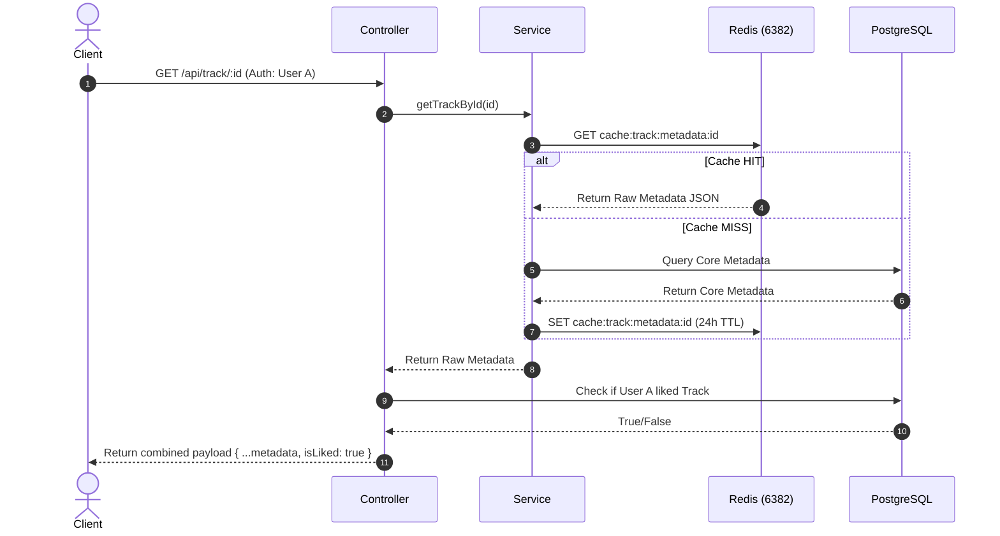

# Metadata Caching with Redis

This document outlines the Service-Level caching strategy implemented on top of our read endpoints to reduce database load.

---

## 1. Architectural Challenge: The Personalization Problem

In an audio application, many public endpoints (like search results, public artist profiles, and album details) return identical core metadata, but require **user-specific hydration** (e.g., whether the current user has "liked" the track, or whether draft elements are visible).

If we cached the entire JSON response at the Express route middleware level globally, a request from User A (who has liked Track X) would be cached. User B requesting the same page would receive the cached payload and mistakenly see Track X as liked.

### Solution: Service-Level Caching + Dynamic Hydration

Instead of caching controller JSON responses, we cache the **raw database metadata** in Redis and inject user-specific personalization states dynamically on every request.

---

## 2. Cached Modules & TTL Configuration

We connect to a dedicated Redis container on port `6382` reserved for metadata caching.

### A. Search Query Results (`GET /api/search`)

- **Key**: `search:raw:<queryString>`
- **TTL**: 5 minutes (`300` seconds)
- **Behavior**: Caches the raw result array (artists, tracks, albums, playlists) returned by database trigram text queries. The like status of tracks is dynamically mapped based on the requesting user ID.

### B. Track Details (`GET /api/track/:id`)

- **Key**: `track:metadata:<trackId>`
- **TTL**: 24 hours (`86400` seconds)
- **Behavior**: Caches the main track details, associated artist, and album records. Like status is mapped dynamically.

### C. Artist Profiles (`GET /api/artist/:artistName`)

- **Key**: `artist:profile:<artistName>`
- **TTL**: 24 hours (`86400` seconds)
- **Behavior**: Caches public artist profiles including their published albums list, top 5 popular tracks metadata, and counters.

### D. Album Details (`GET /api/album/:id`)

- **Key**: `album:metadata:<albumId>`
- **TTL**: 24 hours (`86400` seconds)
- **Behavior**: Caches published album details and tracklists. Draft albums bypass this cache completely to ensure FGA checks are run on the live database.

---

## 3. Cache Eviction (Invalidation) Rules

To prevent serving stale data to clients, we implement proactive cache eviction on writing actions:

| Action                    | Evicts Key                                             | Rationale                                                             |
| :------------------------ | :----------------------------------------------------- | :-------------------------------------------------------------------- |
| **Update Track**          | `track:metadata:<id>` `artist:profile:<artistName>` | Updates title/details and refreshes the artist's popular tracks list. |
| **Delete Track**          | `track:metadata:<id>` `artist:profile:<artistName>` | Removes the track and updates the artist's list.                      |
| **Update Artist Profile** | `artist:profile:<artistName>`                          | Updates bio, images, or metadata.                                     |
| **Update Album**          | `album:metadata:<id>` `artist:profile:<artistName>` | Updates cover art, release date, or tracklists.                       |
| **Publish Album**         | `album:metadata:<id>` `artist:profile:<artistName>` | Moves status from draft to published, refreshing public visibility.   |
| **Delete Album**          | `album:metadata:<id>` `artist:profile:<artistName>` | Deletes the album from public listings.                               |

---

## 4. Implementation Reference

- **Client Connection**: [`src/lib/cacheRedis.client.ts`](../../../src/lib/cacheRedis.client.ts) (connects to port `6382`).
- **Search Integration**: [`src/modules/search/search.service.ts`](../../../src/modules/search/search.service.ts).
- **Track Integration**: [`src/modules/track/track.service.ts`](../../../src/modules/track/track.service.ts).
- **Artist Integration**: [`src/modules/artist/artist.service.ts`](../../../src/modules/artist/artist.service.ts).
- **Album Integration**: [`src/modules/album/album.service.ts`](../../../src/modules/album/album.service.ts).
