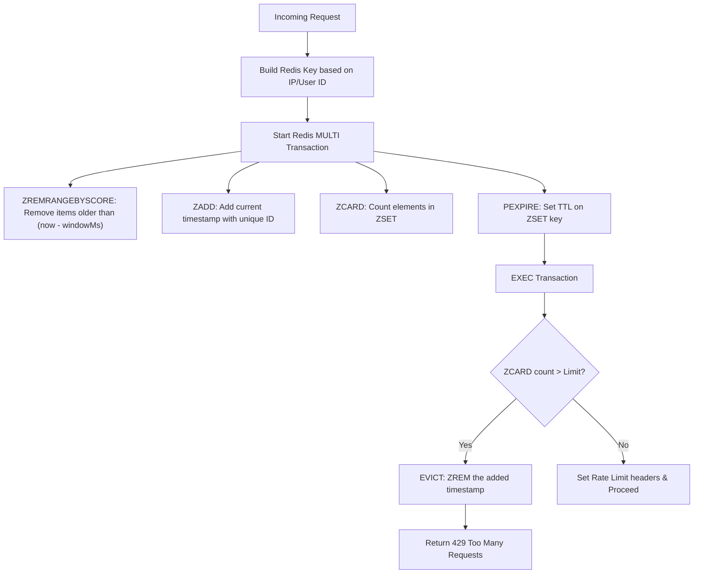

# API Rate Limiting with Redis

This document outlines the design, implementation, and configuration of the sliding-window rate limiting system applied to critical endpoints.

---

## 1. Sliding-Window Architecture

We use a Redis sorted-set (`ZSET`) sliding-window log algorithm to prevent endpoint abuse. Unlike the fixed-window algorithm (which resets at static intervals and is vulnerable to traffic bursts at boundary resets), sliding-window logs measure requests dynamically across a rolling timeframe.



### Redis Key Format

- For Authenticated requests: `ratelimit:user:<user_id>:<route_identifier>`
- For Guests / Unauthenticated requests: `ratelimit:ip:<ip_address>:<route_identifier>`

---

## 2. Dynamic & Static Limits Applied

The rate limiter is applied in two modes: static limits for security-critical actions and dynamic tier-aware limits for search queries.

### A. Dynamic Tier-Aware Search Limit (`GET /api/search`)

Search queries are resource-heavy trigram database lookups. Limits are dynamically mapped depending on the user's active subscription tier:

- **GUEST / FREE Tier**: 60 requests per minute
- **LITE Tier**: 200 requests per minute
- **PRO Tier**: 1000 requests per minute

### B. Static Security Limits

Applied to prevent write abuse, spam, and external billing-provider hammer attacks:

- **Track Play logs (`POST /api/track/:id/play`)**: 30 requests/minute (prevents inflated view farming).
- **S3 Upload URLs (`POST /api/track/upload-url`)**: 10 requests/minute (prevents S3 connection spam).
- **API Key Management (`POST /api/user/keys`)**: 10 requests/minute (prevents DB write spam).
- **Stripe Sessions (`POST /api/payment/checkout`, `/portal`)**: 10 requests/minute (prevents card testing fraud and Stripe API hammer).

---

## 3. Client Headers

Every limited request returns headers to inform clients about their current usage:

- `X-RateLimit-Limit`: Maximum requests allowed in the window.
- `X-RateLimit-Remaining`: Requests remaining within the current sliding window.
- `X-RateLimit-Reset`: Unix epoch timestamp indicating when the window fully resets.

If a limit is exceeded, the server returns an HTTP `429 Too Many Requests` status code with the error:

```json
{
  "success": false,
  "error": "Too many requests. Please try again later."
}
```

---

## 4. Implementation Reference

- **Client Connection**: [`src/lib/rateLimitRedis.client.ts`](../../../src/lib/rateLimitRedis.client.ts) (connects to port `6381`).
- **Middleware**: [`src/middleware/rateLimit/rateLimiter.middleware.ts`](../../../src/middleware/rateLimit/rateLimiter.middleware.ts) (implements the ZSET transaction pipeline).
