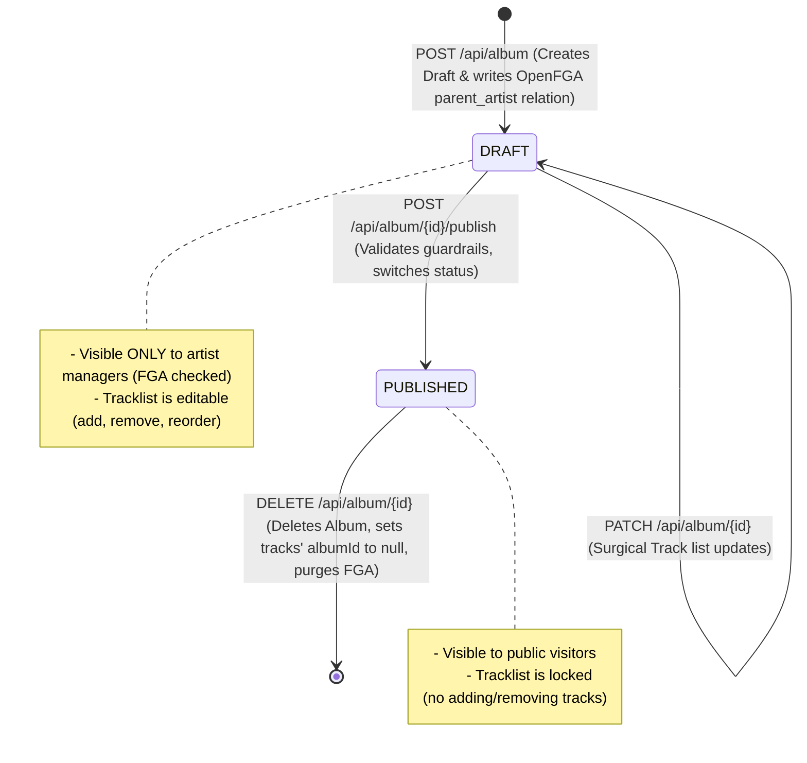

# Album Lifecycle & Validation Guardrails

This document details the lifecycle stages (`DRAFT` and `PUBLISHED`) of an album, FGA ownership mappings, and publication constraints.

---

## 1. Album Lifecycle Diagram

---

## 2. Publication Guardrails (`POST /api/album/:id/publish`)

Before transitioning an album's status from `DRAFT` to `PUBLISHED`, the service performs strict validation checks:

- **State Constraint**: Only tracks in the `ready` state are counted.
- **Track Count**: Number of ready tracks must satisfy: `7 <= count <= 30`.
- **Playtime Duration**: Total sum of `durationSeconds` must satisfy: `20 minutes (1,200s) <= total <= 150 minutes (9,000s)`.
- **Ownership Check**: All tracks must belong to the album's `artistId` (cross-checked against the DB).
