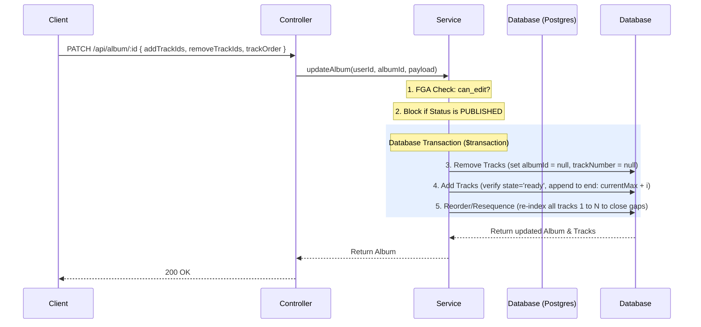

# Album Lifecycle & Tracklist Management

This document details the lifecycle stages (`DRAFT` and `PUBLISHED`), FGA security mapping, and surgical track list updates for Albums.

---

## 1. Album Lifecycle Diagram

```mermaid
stateDiagram-v2
    [*] --> DRAFT : POST /api/album (Creates Draft & writes OpenFGA parent_artist tuple)
    DRAFT --> DRAFT : PATCH /api/album/:id (Surgical Track list updates, reordering)
    DRAFT --> PUBLISHED : POST /api/album/:id/publish (Validates constraints, switches status)
    PUBLISHED --> [*] : DELETE /api/album/:id (Deletes Album record, disassociates tracks, purges FGA)

    note right of DRAFT
        - Visible ONLY to artist managers (FGA checked)
        - Tracklist is editable (add, remove, reorder)
    end note

    note right of PUBLISHED
        - Visible to public visitors
        - Tracklist is locked (no adding/removing tracks)
    end note
```

---

## 2. Surgical Tracklist Updates (`PATCH /api/album/:id`)

When updating the tracks inside a draft album, mutations run sequentially inside a database transaction to prevent race conditions:

---

## 3. Publication Guardrails (`POST /api/album/:id/publish`)

Before transitioning an album status to `PUBLISHED`, the service performs strict validation checks:

- **State Constraint**: Only tracks in the `ready` state are counted.
- **Track Count**: Number of ready tracks must satisfy: `7 <= count <= 30`.
- **Playtime Duration**: Total sum of `durationSeconds` must satisfy: `20 minutes (1,200s) <= total <= 150 minutes (9,000s)`.
- **Ownership Check**: All tracks must belong to the album's `artistId` (cross-checked against the DB).
