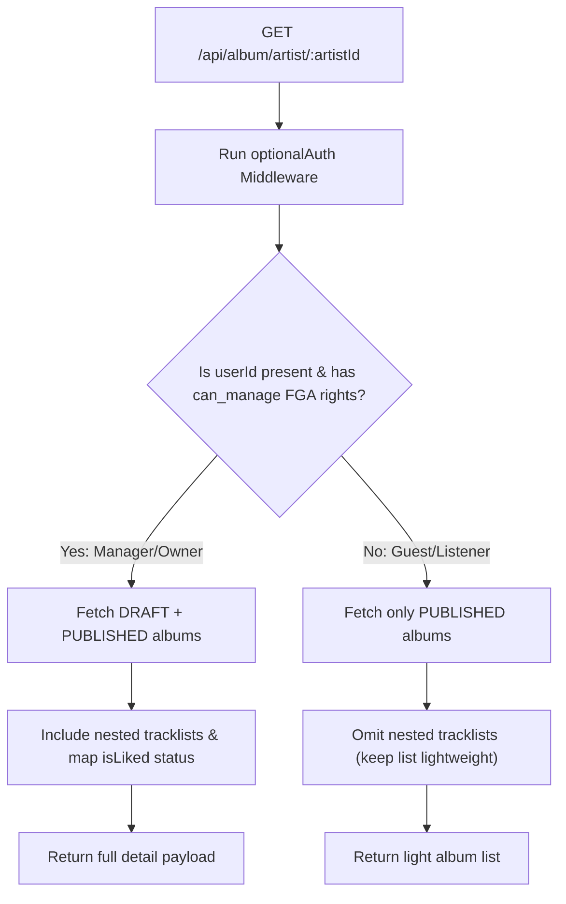

# Album Retrieval & Owner Views

This document outlines unified retrieve-by-artist and retrieve-by-id queries for albums, detailing how access authorization alters the payload.

---

## 1. Unified Retrieval Flow (`GET /api/album/artist/:artistId`)

To avoid separate public and private endpoints, retrieving an artist's albums is consolidated under a single route using `optionalAuth`. This endpoint supports cursor-based pagination using the optional `limit` and `cursor` query parameters.

- **Guest Access or Listener Access**: If the caller is not authenticated, or does not have `can_manage` rights to the artist profile, only `PUBLISHED` albums are returned. Tracks are **not** included in the response.
- **Manager or Owner Access**: If the caller is authenticated and has `can_manage` permission on `artist_profile:${artistId}`, the API returns **both** `DRAFT` and `PUBLISHED` albums. It also loads the nested track lists, mapping personalized `isLiked` properties for each track.

---

## 2. Get Album Details (`GET /api/album/:id`)

When requesting a single album's details:

- If the album is in `DRAFT` status: OpenFGA validates if the caller has `can_edit` or `can_manage` permission. If unauthorized, returns `403 Forbidden`.
- If the album is `PUBLISHED`: Anyone (guests and listeners) can view the album and its tracklist. Registered listeners have personalized `isLiked` status mapped for all tracks.
