# Album Tracklist Management

This document explains the transactional process of updating, adding, removing, and reordering tracks in a draft album.

---

## 1. Surgical Tracklist Updates (`PATCH /api/album/:id`)

When updating the tracks inside a draft album, mutations run sequentially inside a database transaction to prevent race conditions:

```mermaid
sequenceDiagram
    participant Client
    participant Controller
    participant Service
    participant Database (Postgres)

    Client->>Controller: PATCH /api/album/:id { addTrackIds, removeTrackIds, trackOrder }
    Controller->>Service: updateAlbum(userId, albumId, payload)
    Note over Service: 1. FGA Check: can_edit?
    Note over Service: 2. Block if Status is PUBLISHED

    rect rgb(32, 52, 83)
        Note over Service: Database Transaction ($transaction)
        Service->>Database: 3. Remove Tracks (set albumId = null, trackNumber = null)
        Service->>Database: 4. Add Tracks (verify state='ready', append to end: currentMax + i)
        Service->>Database: 5. Reorder/Resequence (re-index all tracks 1 to N to close gaps)
    end

    Database-->>Service: Return updated Album & Tracks
    Service-->>Controller: Return Album
    Controller-->>Client: 200 OK
```

---

## 2. Constraints & Safeguards

- **Status Lock**: If the album status is `PUBLISHED`, track additions and removals are rejected immediately with a `400 Bad Request` to preserve catalog metadata integrity.
- **Sequential Track Indexing**: Adding tracks assigns indices sequentially starting from `currentMax + 1`. A cleanup step then loops through all tracks in `trackOrder`, rewriting `trackNumber` from `1` to `N` to ensure a dense, contiguous indexing sequence with no gaps.
