# Artist Profile Lifecycle & Onboarding

This document explains the lifecycle of an artist profile: creation, slug validation, transactional outbox logging for FGA setup, and rollback Sagas.

---

## 1. Artist Onboarding Flow

When a user creates an artist profile, we insert it into PostgreSQL and register an `Outbox` sync item. A background worker picks up the outbox job to configure OpenFGA permissions. If OpenFGA fails, a compensating SAGA deletes the database record.

```mermaid
sequenceDiagram
    autonumber
    actor User as Creator Client
    participant API as SaaS Backend API
    participant Queue as BullMQ (artist-queue)
    participant Worker as Background Worker
    participant DB as PostgreSQL Database
    participant FGA as OpenFGA Client

    User->>API: POST /api/artist { artistName, bio }
    Note over API: Hydrates req.user context
    rect rgb(34, 60, 82)
        Note over API: DB Transaction
        API->>DB: Check name uniqueness & create artistProfile
        API->>DB: Create Outbox task (type: CREATE_ARTIST_PROFILE, status: PENDING)
    end
    API->>Queue: Push ProcessOutbox job (outboxId)
    API-->>User: 210 Created

    %% Background Outbox Job
    Note over Worker: Worker picks up ProcessOutbox job
    Worker->>DB: Set Outbox status to PROCESSING
    Worker->>FGA: Write ownership tuple (user:X is owner of artist_profile:Y)
    Worker->>FGA: Write platform reference tuple
    alt OpenFGA Success
        Worker->>DB: Set Outbox status to COMPLETED
    else OpenFGA Permanent Failure (after 3 retries)
        Note over Worker: Saga compensating transaction triggered
        Worker->>DB: Delete artistProfile record (Wipe Ghost Profile)
        Worker->>DB: Set Outbox status to FAILED_AND_ROLLED_BACK
    end
```

---

## 2. Profile Updates & Visibility

- **Metadata Updates (`PATCH /api/artist/:id`)**: Authorized creators and managers (verified via FGA `can_manage`) can update the bio and artist name. Name updates enforce global uniqueness constraints database-side.
- **Profile Views (`GET /api/artist/:artistName`)**: Public profile fetches are unified via `optionalAuth`, resolving basic artist details and published works without requiring credentials.
