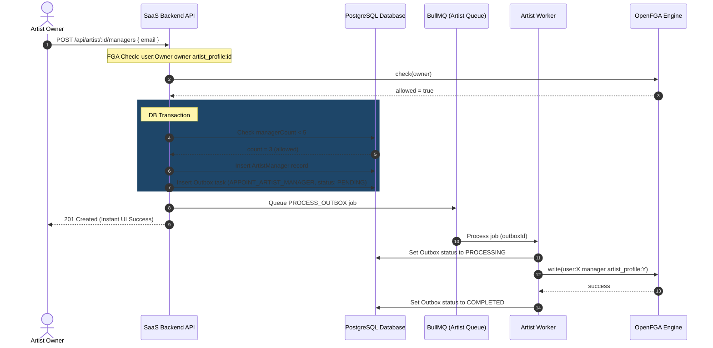

# Artist Profile Manager Delegation

To allow artists to delegate management tasks, they can appoint up to 5 managers to their artist profile. This uses a hybrid design combining a PostgreSQL relational join table with OpenFGA authorization sync via an Outbox worker.

---

## 1. Appoint Manager Flow (DB Transaction + Outbox Sync)

The delegation write is executed sequentially inside a database transaction to enforce business rules (limit of 5 managers), while permission writes are decoupled asynchronously via BullMQ.

---

## 2. API Endpoints Behavior

All endpoints reside under the authenticated router section.

| HTTP Method | Route Path                            | Access Control Rule | Database Interaction                                          | FGA Asynchronous Task                   |
| :---------- | :------------------------------------ | :------------------ | :------------------------------------------------------------ | :-------------------------------------- |
| `POST`      | `/api/artist/:id/managers`            | Only `owner`        | Inserts `ArtistManager` join row and `Outbox` sync task.      | `APPOINT_ARTIST_MANAGER` tuple write.   |
| `DELETE`    | `/api/artist/:id/managers/:managerId` | Only `owner`        | Deletes `ArtistManager` join row and `Outbox` sync task.      | `REVOKE_ARTIST_MANAGER` tuple deletion. |
| `GET`       | `/api/artist/:id/managers`            | Any `can_manage`    | Directly queries `ArtistManager` joined with `User` metadata. | None (Fast DB Read).                    |

---

## 3. SAGA Compensating Transactions

If the BullMQ worker exhausts all 3 retries (e.g., OpenFGA is permanently unavailable), the worker runs a rollback transaction to ensure consistency:

- **Appoint Failure**: Deletes the database `ArtistManager` join row so the user does not appear as a manager in the DB.
- **Revoke Failure**: Re-inserts/restores the database `ArtistManager` join row since their permission tuple still exists in OpenFGA.
