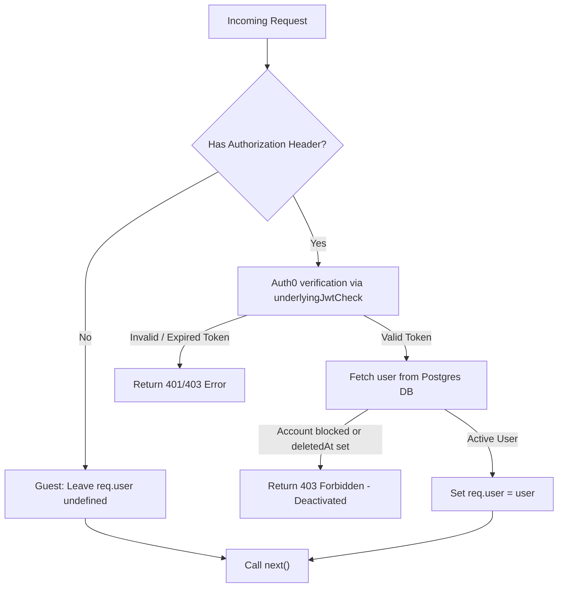

# Authentication & Authorization Middleware

This document outlines the authentication, JWT check, and hydration middleware configuration in the application.

---

## 1. Optional Authentication Flow

Consolidated read routes use the `optionalAuth` middleware. If an `Authorization` header is present, it validates the Auth0 JWT. If valid, it hydrates `req.user` from the database. If absent, the request proceeds anonymously (allowing guest access).

---

## 2. Protected Routes (jwtCheck & hydrateUser)

For write and mutation routes, authentication is strictly enforced using `jwtCheck` and `hydrateUser` sequentially:

1.  **`jwtCheck`**: Verifies the Auth0 JWT access token. If missing or invalid, throws a `401 Unauthorized` error.
2.  **`hydrateUser`**: Queries PostgreSQL to load the full `User` record into `req.user`. If `isBlocked` is true or `deletedAt` is populated, it acts as a **Kill Switch**, throwing a `403 Forbidden` error.

---

## 3. Consolidated Routes Reference

| Route Path                        | Method | Guest (Anonymous) Behavior                                                            | Authenticated Behavior                                                                                         |
| :-------------------------------- | :----: | :------------------------------------------------------------------------------------ | :------------------------------------------------------------------------------------------------------------- |
| `GET /api/track/artist/:artistId` | `GET`  | Returns tracks with `isLiked: false`.                                                 | Returns tracks with personalized `isLiked: true/false`.                                                        |
| `GET /api/album/:id`              | `GET`  | Blocks `DRAFT` albums (403). Returns published album with `isLiked: false` on tracks. | Allows `DRAFT` album preview if requester is the creator (via OpenFGA). Returns personalized `isLiked` status. |
| `GET /api/artist/:artistName`     | `GET`  | Returns public artist profile. `isLiked` is `false` for all tracks.                   | Returns artist profile. Tracks have personalized `isLiked` status.                                             |
| `POST /api/track/:id/play`        | `POST` | Records play count for analytics without linking to a user profile.                   | Records play count and logs track play to user's personalized history.                                         |
