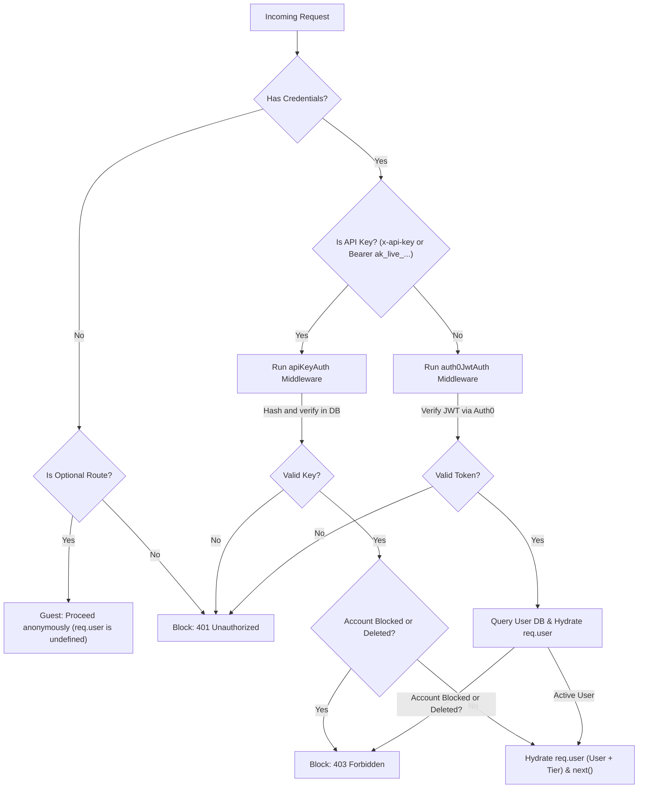

# Authentication & Authorization Middleware

This document outlines the unified authentication system supporting both browser-based Auth0 JWT tokens and long-lived Custom API Keys.

---

## 1. Unified Authentication Architecture

Our routing layer supports two authentication mechanisms interchangeably:

1.  **Auth0 JWT Flow**: Used by the React frontend dashboard via short-lived Auth0 access tokens.
2.  **Custom API Key Flow**: Used by developer integrations and scripts via long-lived, user-revocable keys (`ak_live_...`).

We use a unified wrapper middleware to dynamically route incoming requests:

---

## 2. Core Middleware Reference

The middleware handlers are located in [src/middleware/auth/](../../../src/middleware/auth/).

### A. `requireAuth`

- **File**: [requireAuth.middleware.ts](../../../src/middleware/auth/requireAuth.middleware.ts)
- **Behavior**: A routing middleware applied to protected routes. If `x-api-key` or a token starting with `ak_live_` is present, it routes to `apiKeyAuth`. Otherwise, it falls back to `auth0JwtAuth`.

### B. `optionalAuth`

- **File**: [optionalAuth.middleware.ts](../../../src/middleware/auth/optionalAuth.middleware.ts)
- **Behavior**: Applied to public endpoints that support personalization (e.g. search, track streaming). If no credentials are provided, it calls `next()` to proceed as a guest. If credentials are provided, it runs verification and blocks only if the keys/tokens are invalid.

### C. `apiKeyAuth`

- **File**: [apiKeyAuth.middleware.ts](../../../src/middleware/auth/apiKeyAuth.middleware.ts)
- **Behavior**: Extracts the raw key, hashes it using SHA-256, and queries the database `ApiKey` table to locate the user profile. Once verified, it hydrates `req.user` with user metadata and their active subscription tier.

### D. `auth0JwtAuth`

- **File**: [auth0JwtAuth.middleware.ts](../../../src/middleware/auth/auth0JwtAuth.middleware.ts)
- **Behavior**: Sequentially calls `jwtCheck` (verifying token signatures and audience) and `hydrateUser` (fetching the user profile from PostgreSQL and resolving subscription tiers).

---

## 3. API Key Lifecycle & Verification

- **Hashing**: API Keys are never stored raw in the database. When created, we generate a secure token prefixed with `ak_live_`, hash it using SHA-256, and save the hash. Verification is performed by hashing the incoming key and matching the hash against the index in the `api_keys` table.
- **Revocation**: If a developer deletes a key, we instantly drop its record from the database. Subsequent requests will fail with a `401 Unauthorized` error.
- **Deactivation**: If a user is blocked or soft-deleted, both `apiKeyAuth` and `auth0JwtAuth` will instantly block the request with a `403 Forbidden` error.
