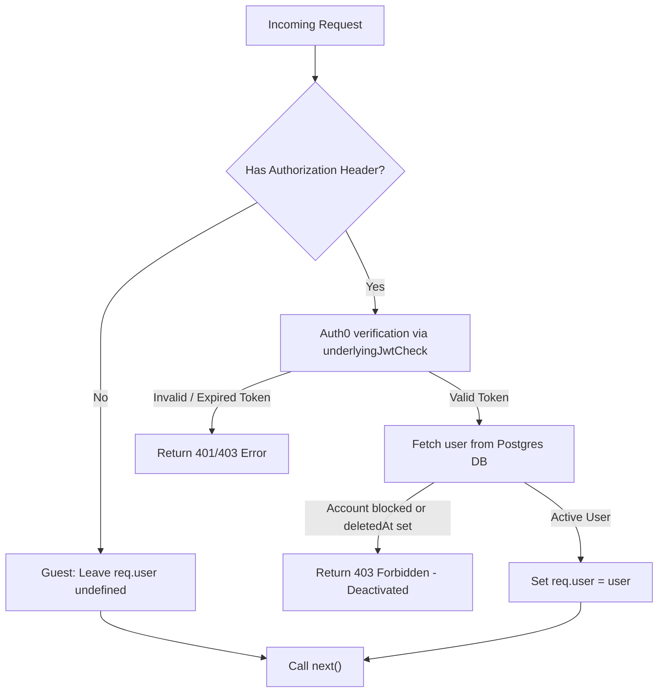

# Soft-Auth & Unified Route Consolidation

The application consolidates public and private endpoints into single unified routes using the `optionalAuth` middleware. This eliminates the need for separate `/pvt` routes, simplifies frontend integration, and enables dynamic personalization (like `isLiked` flags) for authenticated users while maintaining public access for guests.

---

## 1. Optional Authentication Flow

The `optionalAuth` middleware intercepts the request. If an `Authorization` header is present, it validates the Auth0 JWT. If valid, it hydrates `req.user` from the database. If absent, the request proceeds anonymously.

---

## 2. Consolidated Routes Reference

The following table summarizes how consolidated endpoints handle guest vs. authenticated requests:

| Route Path                        | Method | Guest (Anonymous) Behavior                                                            | Authenticated Behavior                                                                                         |
| :-------------------------------- | :----: | :------------------------------------------------------------------------------------ | :------------------------------------------------------------------------------------------------------------- |
| `GET /api/track/artist/:artistId` | `GET`  | Returns tracks with `isLiked: false`.                                                 | Returns tracks with personalized `isLiked: true/false`.                                                        |
| `GET /api/album/:id`              | `GET`  | Blocks `DRAFT` albums (403). Returns published album with `isLiked: false` on tracks. | Allows `DRAFT` album preview if requester is the creator (via OpenFGA). Returns personalized `isLiked` status. |
| `GET /api/artist/:artistName`     | `GET`  | Returns public artist profile. `isLiked` is `false` for all tracks.                   | Returns artist profile. Tracks have personalized `isLiked` status.                                             |
| `POST /api/track/:id/play`        | `POST` | Records play count for analytics without linking to a user profile.                   | Records play count and logs track play to user's personalized history.                                         |

---

## 3. Implementation Details

- **JWT Interception:** Wrapping `express-oauth2-jwt-bearer`'s `auth` handler allows catch-block redirection. If validation errors occur on present headers, we return an auth error, preventing spoofing attempts with invalid tokens.
- **Strict Checks:** Account deactivation/block switches are validated synchronously on DB hydration, immediately returning a `403` to prevent actions by suspended users.
