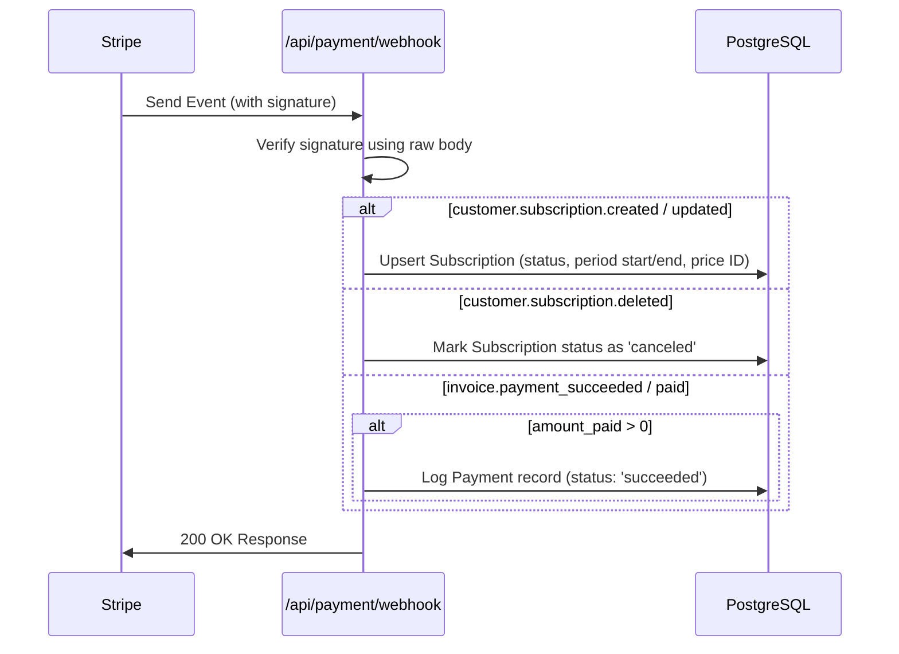

# Payment and Subscription Documentation

This document describes the design, database schema, and runtime architecture of the billing and subscription module.

---

## 1. Subscription Tiers

Our application supports three subscription tiers, defined in the `UserTier` enum:

1.  **`FREE`**: The default tier for all users. No active subscription is required.
2.  **`LITE`**: Paid tier matching the `STRIPE_LITE_PRICE_ID` price.
3.  **`PRO`**: Paid tier matching the `STRIPE_PRO_PRICE_ID` price.

---

## 2. Dynamic Tier Evaluation (No Database Synchronization Drift)

To prevent out-of-sync states between Stripe and our database, we do **not** store the user's tier as a static column in the `User` table. Instead, we compute the tier dynamically at runtime on every request.

### The Algorithm

When a request is hydrated via [userHydration](../../../src/middleware/auth/userHydration.middleware.ts) or [optionalAuth](../../../src/middleware/auth/optionalAuth.middleware.ts):

1.  We fetch all subscriptions associated with the user.
2.  We look for an active subscription where:
    - `status` is either `'active'` or `'trialing'`.
    - `currentPeriodEnd` is in the future (`> new Date()`).
3.  If no such subscription exists, the user is on the `FREE` tier.
4.  If an active subscription is found, we map its `stripePriceId` to the corresponding tier:
    - `stripePriceId === env.STRIPE_PRO_PRICE_ID` $\rightarrow$ `UserTier.PRO`
    - `stripePriceId === env.STRIPE_LITE_PRICE_ID` $\rightarrow$ `UserTier.LITE`
5.  The resolved tier is attached to `req.user.tier`.

---

## 3. Webhook Architecture

We process Stripe webhook events at `POST /api/payment/webhook` to keep our database in sync with billing events. The webhook uses raw body parsing to verify signatures.

### Webhook Resilience & Fallbacks

- **API Version Compatibility**: Stripe webhook payloads for newer API versions (e.g., `2025-03-31.basil` or later) relocate billing period timestamps to the subscription items array. Our webhook handler checks both the top-level subscription object and the first subscription item (`subscription.items.data[0]`) to extract `currentPeriodStart` and `currentPeriodEnd`.
- **Traceability & Payment Intent Fallback**:
  - During the initial Stripe Checkout signup for a new user, `invoice.payment_intent` is returned as `null` because the funds are captured by the checkout session itself.
  - In this case, we use the **Invoice ID** (`invoice.id`) as the value for the `stripePaymentIntentId` field in our `Payment` table.
  - This column acts as a general **Payment Traceability ID** for auditing and tracking transaction history.
  - _Future TODO_: Rename the `stripePaymentIntentId` column in our schema to `paymentTraceabilityId` to clearly reflect that it holds either a Stripe Payment Intent ID or a Stripe Invoice ID.
