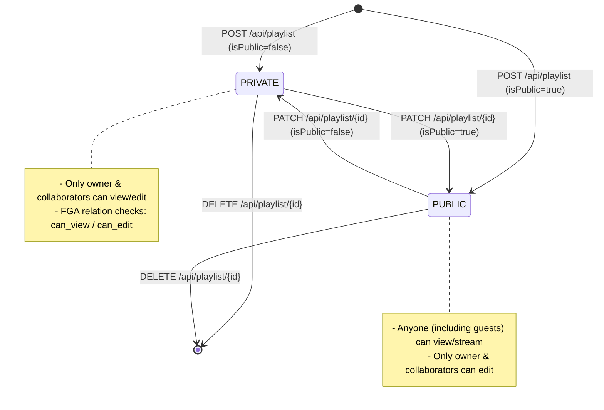

# Playlist Lifecycle & Authorization

This document details the lifecycle of a playlist, including CRUD actions, limits, and OpenFGA visibility policies.

---

## 1. Playlist Lifecycle & Authorization

Playlists support standard CRUD operations. Access control is validated using OpenFGA depending on whether the playlist is public or private:

---

## 2. Limits & Rules Summary

The playlist services enforce hardcoded constraints during write transactions:

- **Playlist Limit**: A maximum of **10 playlists** can be created per user. If this threshold is reached, creation attempts are rejected with a `400 Bad Request` block.
- **Decoupled Metadata**: Playlist tracks link directly to the central `Track` table. Play counts, likes, and transcode statuses are preserved natively.
