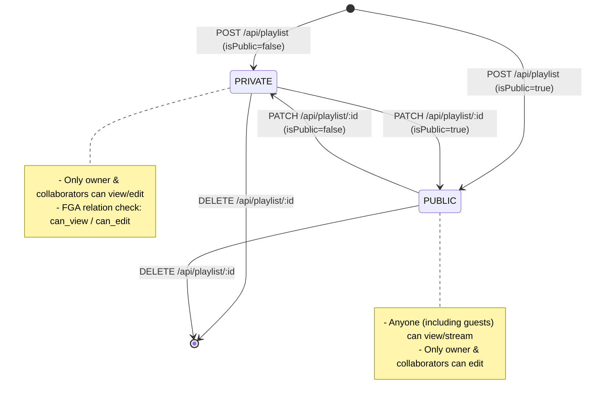

# Playlist Lifecycle & Tracklist Management

This document details the playlist lifecycle, capacity limits, OpenFGA security mappings, and track reordering mechanics.

---

## 1. Playlist Lifecycle & Authorization

Playlists support standard CRUD actions, but access control changes depending on whether the playlist is public or private.



---

## 2. Track Sequencing & Resequencing (Close Gaps)

Tracks within a playlist are linked via the `PlaylistTrack` explicit join table which stores a `position` parameter. Adding or removing tracks dynamically re-calculates these indices inside database transactions using optimized bulk database operations (e.g. `createMany` for inserts, and a single raw PostgreSQL `CASE` statement update for re-sequencing positions in one database roundtrip) to ensure gapless, sequential numbering (from `1` to `N`):

```mermaid
sequenceDiagram
    autonumber
    actor User as Authenticated Owner
    participant API as SaaS Backend API
    participant DB as PostgreSQL Database

    %% Add Track Flow
    User->>API: POST /api/playlist/:id/tracks { trackIds }
    Note over API: FGA Check: user:User can_edit playlist:id
    rect rgb(24, 88, 55)
        Note over API: DB Transaction
        API->>DB: Check capacity + trackIds.length <= 100
        API->>DB: Fetch current max position (M)
        API->>DB: Fetch existing track subset to filter duplicates
        API->>DB: Create remaining entries in bulk via createMany
    end
    API-->>User: 201 Created

    %% Remove Track Flow
    User->>API: DELETE /api/playlist/:id/tracks/:trackId
    Note over API: FGA Check: user:User can_edit playlist:id
    rect rgb(86, 31, 31)
        Note over API: DB Transaction
        API->>DB: Delete PlaylistTrack join row
        API->>DB: Fetch remaining tracks ordered by position asc
        API->>DB: Re-sequence all positions in 1 raw SQL bulk UPDATE query
    end
    API-->>User: 204 No Content
```



---

## 3. Limits & Rules Summary

The playlist services enforce hardcoded constraints during write transactions:

- **Playlist Limit**: A maximum of **10 playlists** can be created per user.
- **Track Capacity**: A maximum of **100 tracks** can be added to a single playlist.
- **Decoupled Metadata**: The playlist tracks link directly to the central `Track` table. Play counts, like counts, and transcode statuses are preserved natively.

---

## 4. Paginated Queries & Search (Cursor-based)

To retrieve playlists efficiently without offset performance scaling issues, the API implements cursor-based pagination (native Prisma pagination with `take: limit + 1`):

- **Search Playlists (`GET /api/playlist`)**: Returns case-insensitive matching public playlists for guests, and public + owned private playlists for authenticated users.
- **Get User Playlists (`GET /api/playlist/user/:userId`)**: Returns the specified user's public playlists. If the requester is fetching their own list, private playlists are also included.

### Request Query Parameters

- `cursor`: string (optional, UUID of the last playlist from the previous page).
- `limit`: number (optional, default 10).
- `search`: string (optional, only for the `/` search endpoint).

### Pagination Response Format

```json
{
  "data": [
    {
      "id": "c17afdc1-e00a-4b07-933d-d4016f8165d5",
      "userId": "auth0|...",
      "name": "Relaxing Lo-Fi",
      "thumbnailUrl": null,
      "isPublic": false,
      "createdAt": "2026-06-27T11:30:00.000Z"
    }
  ],
  "nextCursor": "c17afdc1-e00a-4b07-933d-d4016f8165d5",
  "hasMore": true
}
```

If `hasMore` is `true`, pass the `nextCursor` value into the `cursor` query parameter on the subsequent request to fetch the next page.
