# Playlist Tracklist Management

This document details track sequencing, reordering, limits, and SQL transaction optimizations inside a playlist.

---

## 1. Track Sequencing & Resequencing

Tracks within a playlist are linked via the `PlaylistTrack` join table, which stores a `position` parameter. Adding or removing tracks dynamically re-calculates these indices inside database transactions to ensure gapless, sequential numbering (from `1` to `N`):

```mermaid
sequenceDiagram
    autonumber
    actor User as Authenticated Owner
    participant API as SaaS Backend API
    participant DB as PostgreSQL Database

    %% Add Track Flow
    User->>API: POST /api/playlist/:id/tracks { trackIds }
    Note over API: FGA Check: user can_edit playlist:id
    rect rgb(24, 88, 55)
        Note over API: DB Transaction
        API->>DB: Check capacity + trackIds.length <= 100
        API->>DB: Fetch current max position (M)
        API->>DB: Fetch existing track subset to filter duplicates
        API->>DB: Create remaining entries in bulk via createMany
    end
    API-->>User: 201 Created

    %% Remove Track Flow
    User->>API: DELETE /api/playlist/:id/tracks/:trackId
    Note over API: FGA Check: user can_edit playlist:id
    rect rgb(86, 31, 31)
        Note over API: DB Transaction
        API->>DB: Delete PlaylistTrack join row
        API->>DB: Fetch remaining tracks ordered by position asc
        API->>DB: Re-sequence all positions in 1 raw SQL bulk UPDATE query
    end
    API-->>User: 204 No Content
```



---

## 2. SQL Batch Optimizations

To avoid expensive SQL loops and database roundtrips when altering tracklist ordering, the backend utilizes optimized queries:

- **Batch Inserts**: Uses Prisma's `createMany` to insert multiple playlist track relations simultaneously.
- **Raw SQL re-sequencing**: Executes a single dynamic `$executeRawUnsafe` query containing a PostgreSQL `CASE` statement to update the `position` of all tracks in one go:

```sql
  UPDATE "playlist_tracks"
  SET "position" = CASE "trackId"
    WHEN 'track-id-1' THEN 1
    WHEN 'track-id-2' THEN 2
    ...
  END
  WHERE "playlistId" = 'playlist-uuid' AND "trackId" IN ('track-id-1', 'track-id-2', ...);
```

_Input track IDs are pre-validated to be UUIDs in the Zod validation schema to guarantee SQL injection safety._

---

## 3. Capacity Constraints

- **Track Capacity**: A maximum of **100 tracks** can be added to a single playlist.
