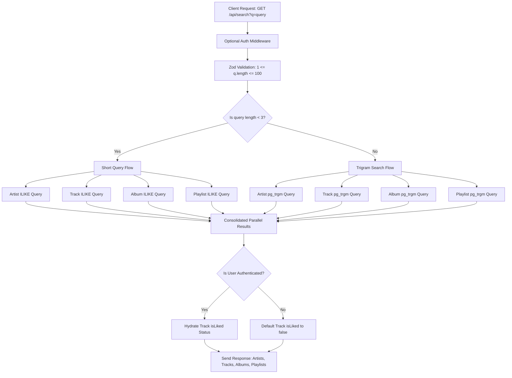

# Search Retrieval Documentation

This document details the architecture, database indexing, and query execution flow of the unified cross-module search endpoint.

---

## Endpoint Overview

- **Route**: `GET /api/search`
- **Authentication**: Optional (supports guest access, hydrates `isLiked` for logged-in users)
- **Query Parameters**:
  - `q` (string, required): The search term (1 to 100 characters).

---

## Architecture Flow

The following diagram illustrates how incoming search requests are processed, validated, and routed through the database matching strategies.

---

## Database Indexing

To support fast fuzzy matching, we natively define **GIN (Generalized Inverted Index)** trigram indexes on the searchable text fields in [schema.prisma](../../../prisma/schema.prisma):

- **`ArtistProfile`**: `artistName` (using `gin_trgm_ops`)
- **`Track`**: `title` (using `gin_trgm_ops`)
- **`Album`**: `title` (using `gin_trgm_ops`)
- **`Playlist`**: `name` (using `gin_trgm_ops`)

---

## Query Strategies

### 1. Trigram Similarity Search (Query Length $\ge$ 3)

Calculates the exact similarity score between the column value and the search term using the `similarity()` function.

- **Sorting**: Ranked by `similarity DESC`.
- **Tie-Breakers**:
  - **Tracks**: `play_count DESC`, then `like_count DESC`
  - **Artists**: `verified DESC`, then `created_at DESC`
  - **Albums**: `release_date DESC`, then `created_at DESC`
  - **Playlists**: `created_at DESC`
- **Safety Guard**: Hard limit of `LIMIT 5` per query.

### 2. Short Query Heuristics (Query Length $<$ 3)

Falls back to `ILIKE` matching but enforces deterministic sorting:

1.  **Match Position**: Exact starts-with matches are ranked higher than contains-matches:
    `position(lower(query) in lower(column)) ASC` (where position 1 is the highest rank).
2.  **String Length**: Shorter matching strings are ranked higher:
    `length(column) ASC`
3.  **Popularity Tie-Breakers**: Popularity/recency fields are used as the final sorting layer.
