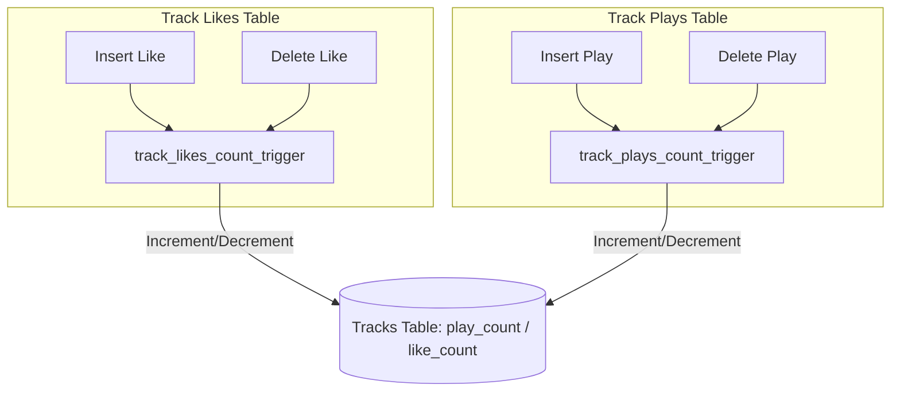
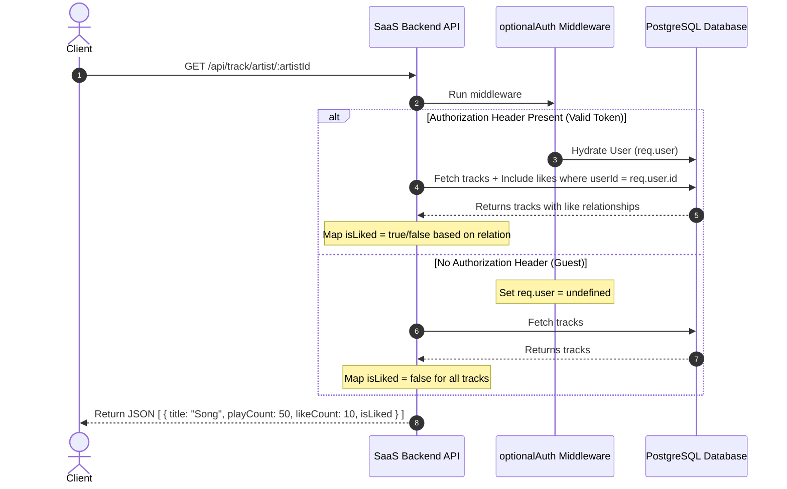

# Track Engagement Counts & Liked Status (`GET /api/track/artist/:artistId`)

To ensure high-performance, real-time reads for track engagement counts and personalization, the backend utilizes PostgreSQL database triggers for counting, combined with separate public and private retrieval endpoints.

---

## 1. Database-Level Counters (Triggers)

Instead of executing slow aggregate queries (`COUNT(*)`) or performing table joins on every read, counters for plays and likes are maintained directly on the `tracks` table.

- **Trigger Mechanisms:**
  - `track_likes_count_trigger`: Triggers `AFTER INSERT OR DELETE` on `track_likes`. Updates `like_count` on the corresponding row in the `tracks` table.
  - `track_plays_count_trigger`: Triggers `AFTER INSERT OR DELETE` on `track_plays`. Updates `play_count` on the corresponding row in the `tracks` table.
- **Benefits:** Reads are $O(1)$ directly from the track row without joins or calculations.

---

## 2. Unified Retrieval Flow (Soft-Auth)

Instead of maintaining separate public and private endpoints, track lists are retrieved from a single unified route. The `optionalAuth` middleware determines the visitor's authentication state dynamically.

- **Unified Route (`GET /api/track/artist/:artistId`):**
  - Handles both anonymous and logged-in users via `optionalAuth`.
  - **Guest Behavior:** Returns track data with `isLiked: false` (fast & cacheable on a CDN).
  - **Authenticated Behavior:** Fetches the tracks while joining the user's `likes` status, dynamically mapping `isLiked: true/false` depending on whether they liked the track.
