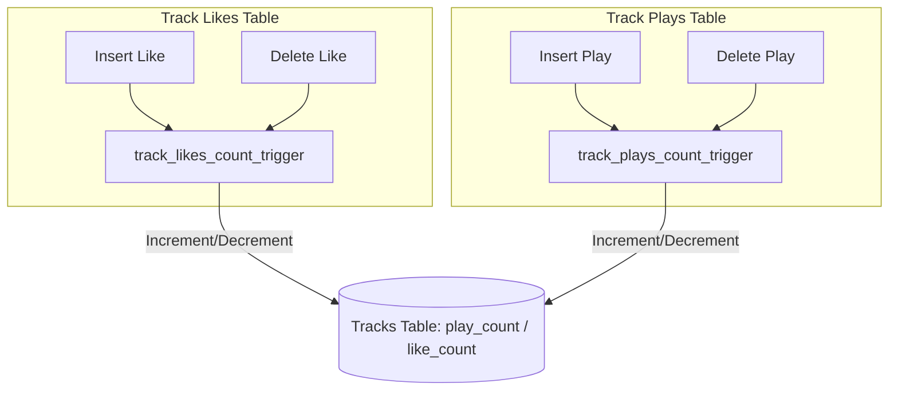
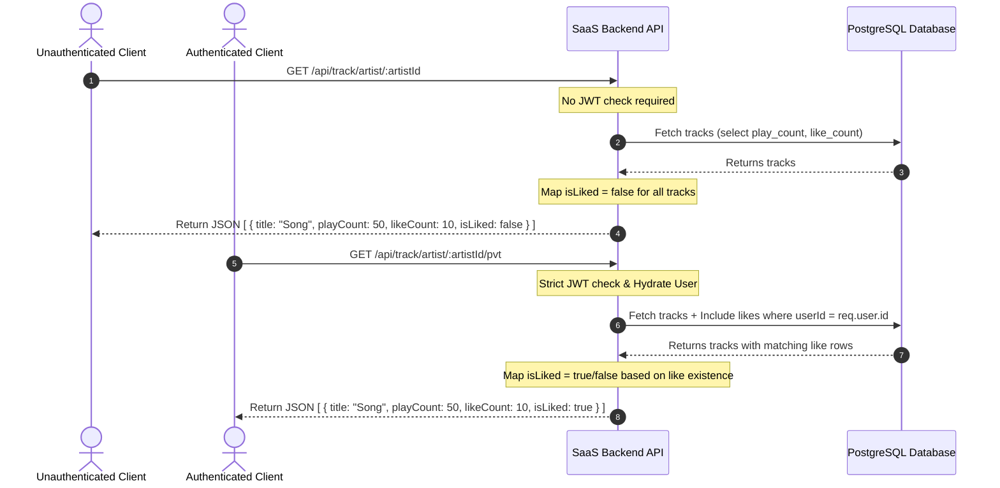

# Track Engagement Counts & Liked Status (`GET /api/track/artist/:artistId`)

To ensure high-performance, real-time reads for track engagement counts and personalization, the backend utilizes PostgreSQL database triggers for counting, combined with separate public and private retrieval endpoints.

---

## 1. Database-Level Counters (Triggers)

Instead of executing slow aggregate queries (`COUNT(*)`) or performing table joins on every read, counters for plays and likes are maintained directly on the `tracks` table.

- **Trigger Mechanisms:**
  - `track_likes_count_trigger`: Triggers `AFTER INSERT OR DELETE` on `track_likes`. Updates `like_count` on the corresponding row in the `tracks` table.
  - `track_plays_count_trigger`: Triggers `AFTER INSERT OR DELETE` on `track_plays`. Updates `play_count` on the corresponding row in the `tracks` table.
- **Benefits:** Reads are $O(1)$ directly from the track row without joins or calculations.

---

## 2. Public vs. Private Retrieval Flow

The client queries different endpoints depending on the authentication state of the user. This keeps the public endpoint fast and fully cacheable, while the private endpoint dynamically hydates personalization data.

- **Public Route (`GET /api/track/artist/:artistId`):**
  - Serves unauthenticated traffic.
  - Returns raw track data including `playCount` and `likeCount`.
  - Automatically maps `isLiked: false` for the entire response.
- **Private Route (`GET /api/track/artist/:artistId/pvt`):**
  - Protected by Auth0 `jwtCheck` and `hydrateUser`.
  - Fetches the track list while querying the `likes` relationship specifically for the logged-in user.
  - Dynamically sets `isLiked` to `true` or `false` based on whether the relation exists.
