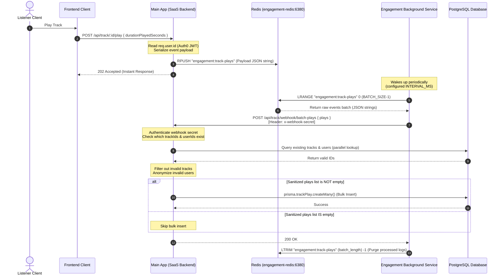

# Record Track Play Flow (`POST /api/track/:id/play`)

To support high-throughput, scale-resilient tracking of track plays without overwhelming the primary database, the track play event logging utilizes an asynchronous Redis list buffer, an isolated background aggregation service, and a batch validation webhook.

---

## Process Flow Diagram



---

## Detailed Pipeline Breakdown

### 1. Ingestion Phase (`recordPlay`)

- **Endpoint:** `POST /api/track/:id/play`
- **Handler:** [recordPlay](file:///home/gourab/coding/audiosass/backend/src/modules/track/track.controller.ts#L39-L46)
- **Behavior:**
  - Authenticates the user via the standard Auth0 middleware.
  - Encapsulates the user ID (`userId`), track ID (`trackId`), duration played (`durationPlayedSeconds`), and current timestamp into a JSON string payload.
  - Pushes the payload to the right side of the Redis list (`engagement:track-plays`) using `RPUSH`.
  - Instantly returns a `202 Accepted` status to the client, decoupling the client UI response time from database write latencies.

### 2. Aggregation Phase (`engagement-bg-svc`)

- **Service Workspace:** [packages/engagement-bg-svc/](file:///home/gourab/coding/audiosass/backend/packages/engagement-bg-svc/)
- **Runner Loop:** Initiated in [index.ts](file:///home/gourab/coding/audiosass/backend/packages/engagement-bg-svc/src/index.ts) with a recursive `setTimeout` to prevent concurrent overlapping executions under latency spikes.
- **Batch Fetch:**
  - Queries a slice of the Redis list from index `0` to `BATCH_SIZE - 1` using `LRANGE` inside [trackPlays.ts](file:///home/gourab/coding/audiosass/backend/packages/engagement-bg-svc/src/jobs/trackPlays.ts).
  - Executes a `POST` request containing the list of play events to the webhook endpoint.

### 3. Validation and Batch Insertion Phase (`processBatchPlays`)

- **Webhook Endpoint:** `POST /api/track/webhook/batch-plays`
- **Service Handler:** [processBatchPlays](file:///home/gourab/coding/audiosass/backend/src/modules/track/track.service.ts#L326-L373)
- **Deadlock & Constraint Resolution:**
  To prevent foreign key constraint violations (e.g. if a track or user was deleted from PostgreSQL while their play events were still buffered in Redis), the backend validates the IDs:
  - **Tracks Lookup:** Collects unique `trackId`s in the batch and queries PostgreSQL using `prisma.track.findMany`. Discards any play event whose `trackId` no longer exists.
  - **Users Lookup:** Collects unique `userId`s in the batch and queries PostgreSQL using `prisma.user.findMany`. If a user was deleted, the `userId` in the play event is set to `null` to record the play anonymously (preventing a foreign key failure while keeping accurate count metrics).
  - **Batch Write:** Executes `prisma.trackPlay.createMany` to bulk insert all remaining sanitized plays in a single database roundtrip. If all events were skipped (e.g., all tracks were deleted), it returns early.

### 4. Purge Acknowledgment

- **Queue Trimming:** If the webhook returns a successful `200 OK` response to the background service, the service issues the `LTRIM` command:
  ```redis
  LTRIM engagement:track-plays <number_of_processed_items> -1
  ```
  This cleanly deletes exactly the processed events from the head of the list, keeping any newer events that were pushed to the tail during the webhook execution.
- **Fail-Safe Logging:** If the webhook returns an error (e.g., database unavailable, network timeout), the background service logs the error and does **not** trim the Redis list. The events remain safely buffered in Redis and will be retried on the next execution loop.
