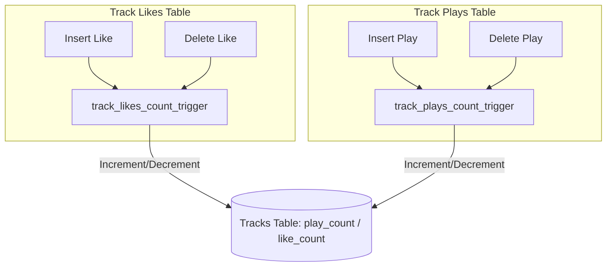
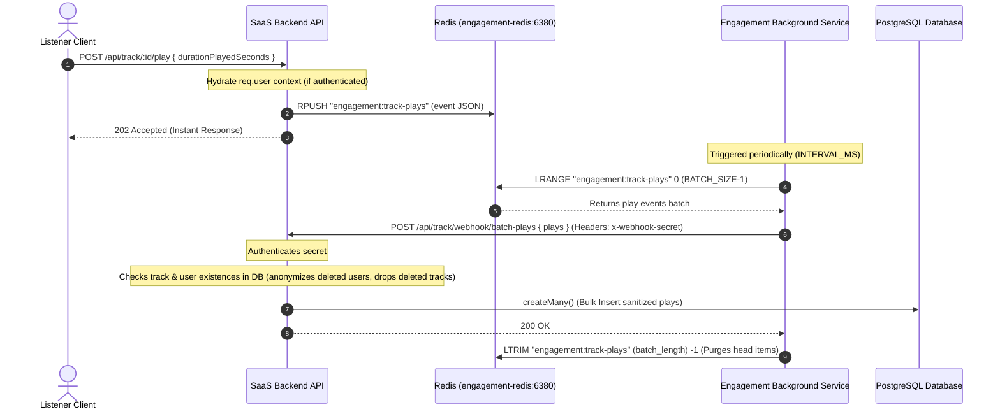

# Track Engagement Counters & Buffer Pipeline

This document details database-level counter triggers and the high-throughput asynchronous play count buffer pipeline.

---

## 1. Database-Level Counters (Triggers)

To support $O(1)$ reads for track engagement without executing expensive aggregates or joins, counts are cached directly on the `tracks` table via database triggers:

- `track_likes_count_trigger`: Updates `like_count` on `tracks` `AFTER INSERT OR DELETE` on `track_likes`.
- `track_plays_count_trigger`: Updates `play_count` on `tracks` `AFTER INSERT OR DELETE` on `track_plays`.

---

## 2. High-Throughput Plays Buffer Pipeline

To avoid database bottlenecks under high-volume streaming, plays are buffered in an asynchronous Redis pipeline:

### Detailed Pipeline Breakdown

1.  **Ingestion (`POST /api/track/:id/play`)**: Validates input duration. Serializes the event (`userId` or `null`, `trackId`, `durationPlayedSeconds`, `playedAt`) and pushes it via `RPUSH` to the `engagement:track-plays` list in Redis. Instantly returns a `202 Accepted`.
2.  **Aggregation (`engagement-bg-svc`)**: A dedicated Node.js service polls Redis periodically, pulling batches using `LRANGE` and posting them to our internal webhook.
3.  **Sanitization & Batch Write (`POST /api/track/webhook/batch-plays`)**:
    - **Orphan Validation**: Cross-checks track and user IDs in the batch.
    - **Cascade Safe**: If a user was deleted, the `userId` field is set to `null` to register the play anonymously (preventing foreign key constraints failures). If a track no longer exists, it is discarded.
    - **Bulk SQL Write**: Inserts the remaining sanitized records inside a single `createMany` transaction block.
4.  **trimming (`LTRIM`)**: Upon receiving `200 OK`, the background service trims the head of the Redis list. If it fails, logs are not trimmed and will be retried.
