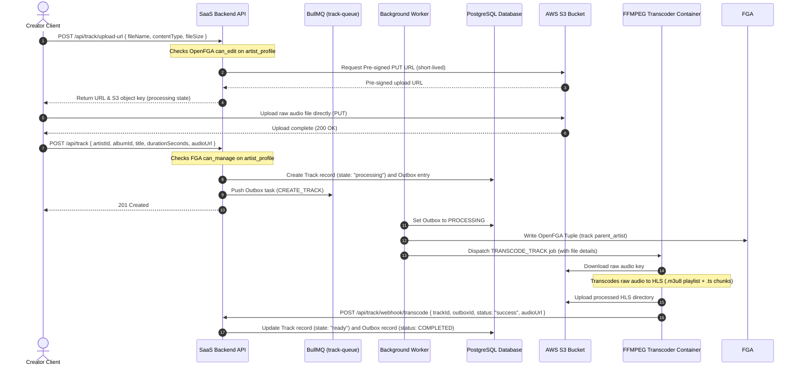
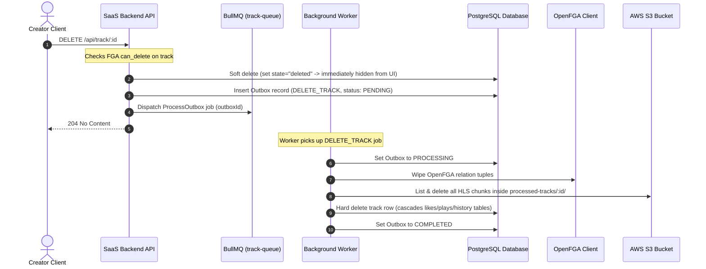

# Track Lifecycle & Pipeline Management

This document details the track lifecycle: from generating S3 pre-signed upload URLs and background transcoding pipeline stages, to updates and cascading deletion.

---

## 1. Track Upload & Transcoding Pipeline

---

## 2. Track Deletion & Asset Purging

When deleting a track, we hide the track immediately from the listener UI, then use a background queue worker to clean up FGA tuples, S3 audio files, and database records:

