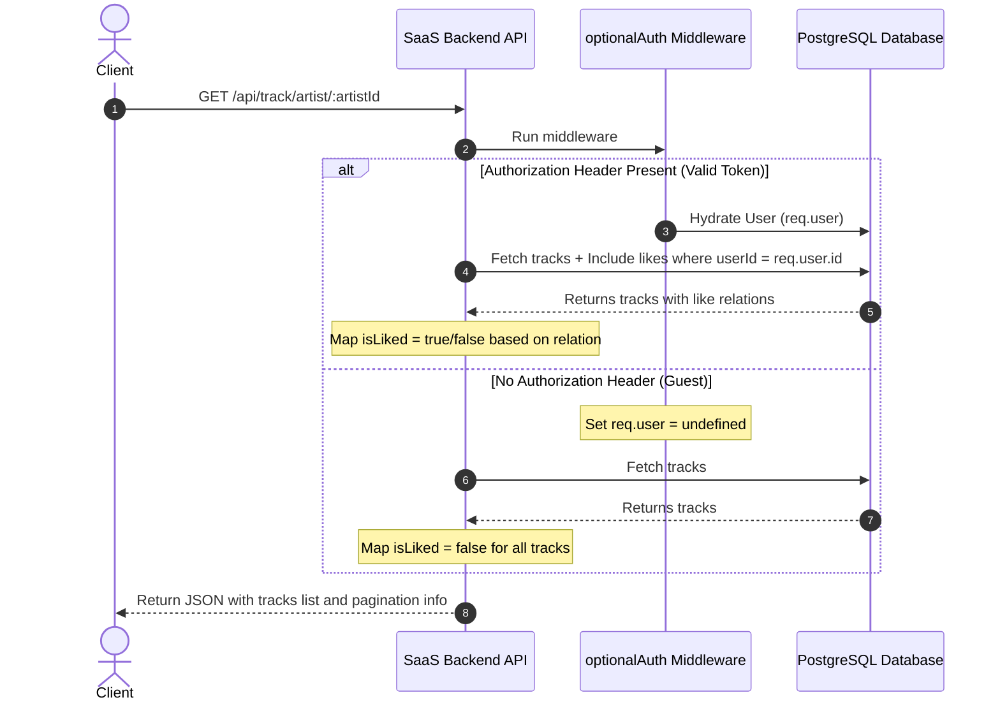

# Track Retrieval & Paginated Listing

This document details unified tracks retrieval, caching guidelines, and cursor-based pagination queries.

---

## 1. Unified Retrieval & State Hydration (Soft-Auth)

To avoid separate public and private GET endpoints, we consolidator retrievals under a single path utilizing the `optionalAuth` middleware:



- **Guest Mode**: Returns `isLiked: false` for all tracks. This payload is completely static and can be safely cached on a CDN edge.
- **Authenticated Mode**: Maps the user's `isLiked` state dynamically.

---

## 2. Cursor-Based Pagination (`GET /api/track/artist/:artistId`)

To fetch tracks efficiently without database offset penalties (which slow down as offset grows), the listing uses cursor-based pagination:

- **Query Ordering**: Sorted by the unique `id` field.
- **Cursor**: The UUID string of the last track returned on the page.
- **Page calculation**: The server queries `limit + 1` records. If the count exceeds `limit`, `hasMore` is set to `true`, and the last element is sliced from the result, setting its `id` as the `nextCursor` for the next request.

### Request Query Parameters

- `cursor`: string (optional, UUID of the last track returned from the previous page).
- `limit`: number (optional, default 10).

### Response Schema

```json
{
  "tracks": [
    {
      "id": "e427d191-4560-4966-9de9-52e1f422e118",
      "artistId": "8f307455-89f5-408a-85d1-9f796a51d9fb",
      "albumId": null,
      "trackNumber": null,
      "title": "Starlight",
      "durationSeconds": 210,
      "audioUrl": "https://...",
      "state": "ready",
      "createdAt": "2026-06-27T12:00:00.000Z",
      "playCount": 100,
      "likeCount": 12,
      "isLiked": true
    }
  ],
  "nextCursor": "e427d191-4560-4966-9de9-52e1f422e118",
  "hasMore": false
}
```

If `hasMore` is `true`, pass the `nextCursor` value into the `cursor` query parameter on the subsequent request to fetch the next page.
