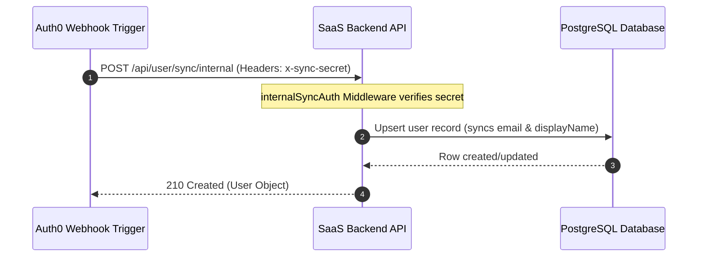
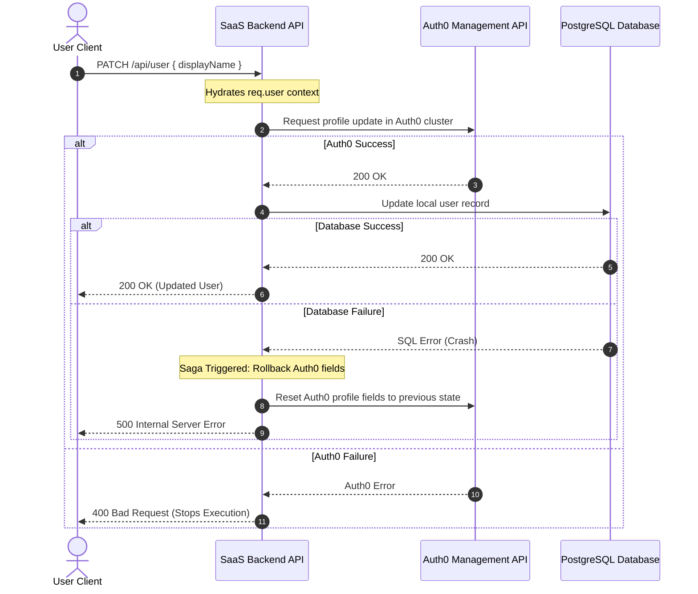
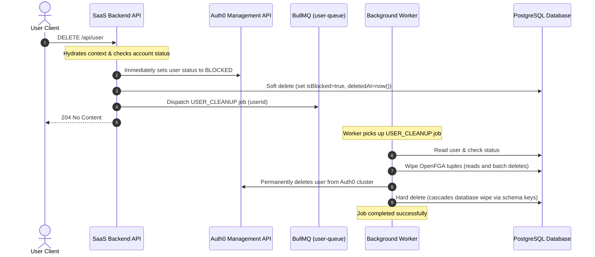

# User Profile Lifecycle

This document describes the complete lifecycle of a user profile: synchronization from Auth0 registration, metadata updates, soft-deletion, and asynchronous permanent scrubbing via background workers.

---

## 1. User Creation & Sync Flow

When a user registers via Auth0, a post-registration trigger webhook calls our internal sync endpoint to register the user record in the database.

---

## 2. Profile Updates & Saga Rollbacks

Updates to a user's details (e.g. `displayName`) are synchronized to both the local database and Auth0. If the database update fails after Auth0 has been modified, a reversion Saga rolls back the change in Auth0 to maintain consistency.

---

## 3. Account Deactivation & Deletion Saga

When a user deletes their account, we execute a soft delete immediately to block access. A background worker then cleans up all relations (OpenFGA tuples, database records) asynchronously before permanently wiping the profile.

